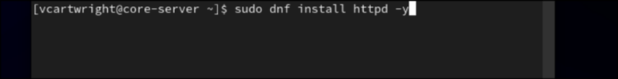
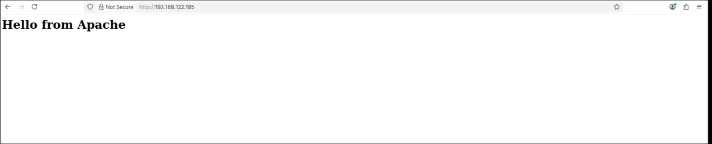
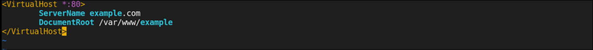
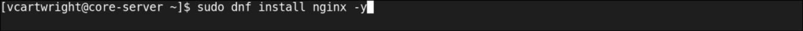
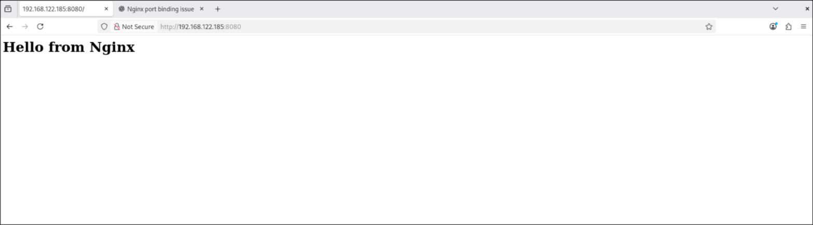
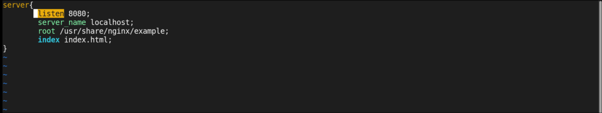

# RHEL 9 Web Server Project

This project shows how to set up Apache and Nginx web servers on RHEL 9. The goal is to practice Linux skills and learn how to run web servers manually.

---

## Why I Did This Project

I made this project to show that I can set up web servers from scratch. Doing this helped me understand services, firewall rules, and how to make websites on Linux.

---

## Repository Structure

```
manual-web-server-setup/
├── README.md
├── apache/
│   ├── example.conf       # Apache virtual host config
│   └── screenshots/
├── nginx/
│   ├── example.conf       # Nginx server block config
│   └── screenshots/
└── docs/
    ├── tips.md            # Troubleshooting tips
    └── steps.md           # Step-by-step setup instructions
```

---

## Apache Setup

* Install Apache, start it, and allow HTTP/HTTPS through the firewall.
* Test the default page.
* Create a custom virtual host for a sample website.

### Apache Screenshots







## Nginx Setup

* Install Nginx and set it to port 8080 so it does not conflict with Apache.
* Create a test website.
* Start Nginx and allow traffic if needed.

### Nginx Screenshots







## Skills Learned

* Installing and running Apache and Nginx
* Managing services with systemd
* Configuring firewall rules
* Setting up virtual hosts and server blocks
* Troubleshooting issues and reading logs

---

## What I Learned

From this project, I learned:

* How to install and run web servers on RHEL 9.
* How to manage services using systemd.
* How to set up firewall rules for web traffic.
* How to create websites using Apache virtual hosts and Nginx server blocks.
* How to troubleshoot when services do not start.
* The importance of documenting steps and taking screenshots.

---

Detailed Setup and Tips

For a detailed step-by-step guide for setting up Apache and Nginx, including commands, firewall configuration, testing the web pages, and troubleshooting tips, see the [steps.md](docs/steps.md)and [`tips.md`](docs/tips.mdfiles. These files are meant to guide someone to replicate the setup exactly as in this project.
